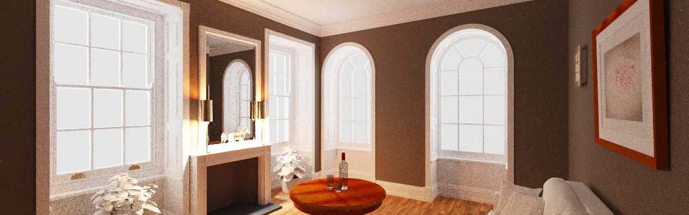
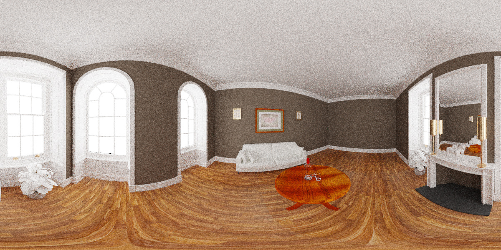
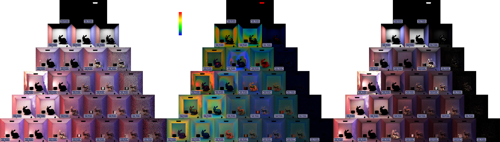

# Zillum

CPU Global Illumination Renderer

- [*ZillumGL - OpenGL version*](https://github.com/HummaWhite/ZillumGL)
- [*Blogs*](https://hummawhite.github.io/posts)

#### Implemented light transport methods

- Path Tracing
- Adjoint Particle Tracing (Light Tracing)
- Bidirectional Path Tracing

#### Other features

- Microfacet BSDF
- Environment light importance sampling
- MTBVH
- Sobol sampler

#### Currently or potentially working on

- Photon Mapping family (PM, PPM, SPPM)
- Metropolis Light Transport
- BSSRDF
- Participating Media
- **VERTEX CONNECTION AND MERGING**
- ...

### Bidirectional Path Tracing

Visualization of different connection strategies and their MIS weights

Unweighted, MIS weight, weighted

